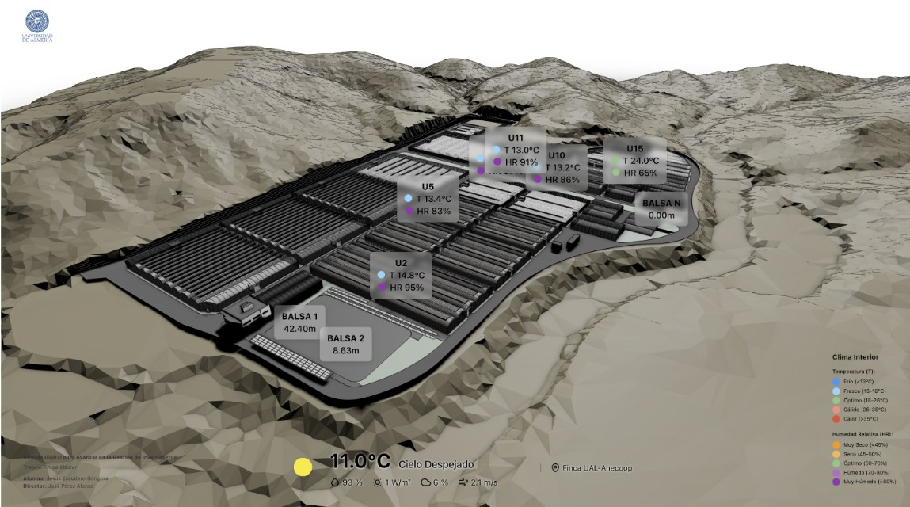
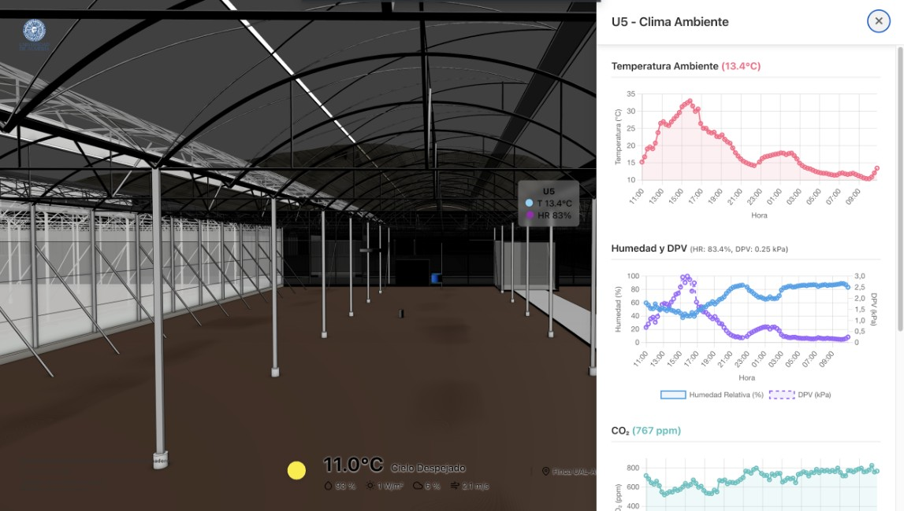
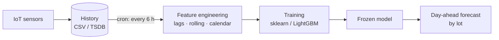
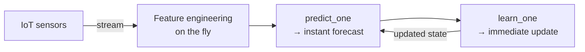

# 🌱  Snap Greenhouse


<p align="center">
  
  &nbsp;&nbsp;
  
</p>

Forecasting the **indoor temperature** (`tempint`) of a connected greenhouse (IoT, unit **U5**)
from sensor data. The goal: **optimize energy management** (heating, ventilation) by
anticipating thermal drift. The project **compares two inference paradigms** — **Batch** (lot-based
forecasting) and **Online** (learning on the fly) — on real data.


## 👁️ Overview

**Batch vs Online** — each test window = <=24 h :


**Adaptation to a new change** — a regime shift injected mid-stream: the batch model (frozen) stays off, the online model re-learns and returns to its pre-shock error level:


> Reproducible: `python results/make_comparison_gif.py` · `python results/make_drift_gif.py`


## 🎯 Context & objective

A greenhouse is a non-stationary environment: seasons, outdoor weather, structural
ageing, crops, sensor failures. A model trained once and frozen drifts out of date — which is where online learning earns its place.

**Objective:** compare the two approaches for forecasting `tempint`:

- **Batch** — trained once on history, then frozen; lot-based prediction
- **Online** — updated on each new sensor reading (`predict → learn`)

**The trade-off:** online is generally less accurate than batch on a stable regime, but *more
robust* over the long run in a living environment.


## 🏗️ Architecture: Batch vs Online

The fundamental difference is the **model update flow**.

**Batch** — frozen between scheduled retrainings:



**Online** — learns continuously, sample by sample:



---

## 🗂️ Project layout

```
snap_greenhouse/
├── config/config.yaml         # spec
├── datas/                     # hide : sensor + external weather data (CSV)
├── notebooks/                 # xps + viz
├── src/                       # source code
│   ├── config.py              # loads config.yaml
│   ├── preprocess.py          # prepare_raw, GreenhousePipeline
│   ├── features.py            # create features
│   ├── cv.py                  # time cross validation
│   ├── model_factory.py       # builds models from the YAML
│   ├── river_model.py         # online model River
│   ├── evaluation.py          # evaluate_folds engine + 3 evaluators
│   ├── metrics.py             # compute_metrics (MAE/RMSE/R²/MAPE)
│   ├── journal.py             # experiment journal (JSON)
│   ├── results.py             # comparison table
│   ├── plots.py               # viz
│   └── runner.py              # orchestration of all models
├── outputs/                   # hide : run journal + per-fold detail
├── results/                   # gifs + scripts
├── requirements-notebook.txt
└── README.md
```

---

## 🧰 Tech stack

- **Python** ≥ 3.10 · **Pandas / NumPy** — time series
- **scikit-learn** · **LightGBM** — batch models
- **River** — online learning (StandardScaler + incremental LinearRegression)
- **Matplotlib** — visualizations & GIF (PillowWriter) · **PyYAML** — config

---

## ⚙️ Installation & configuration

TODO : à compléter

```yaml
target:    tempint
... 
```

---

## 🚀 Usage

TODO

## 📊 Data

TODO

## 🔬 Methodology

**Temporal cross-validation** (`src/cv.py`)
- 2 test windows of **24 h** per month (week-2 and week-4);
- train = all history **prior** to the window.

**Feature engineering** (`src/features.py`, driven by `config.yaml`):
- **calendar**: hour, day, month (sine/cosine encoding), weekend;
- **lags**: `tempint` shifted by 24 h, 48 h…;
- **rolling**: moving mean / std (24 h, 48 h…);
- **trend**: differences between consecutive lags.

**Evaluated models**:
- *baseline*: `naive_24h` (ŷ(t) = temperature 24 h earlier);
- *batch*: LinearRegression, Ridge, Lasso, **Ridge_Poly2**, RandomForest, **LightGBM**;
- *online*: **River** (incremental LinearRegression, SGD / Adam / RMSProp).

---

## 📈 Comparison & Metrics

### Batch vs Online — operational comparison

| Criterion | Batch (`Ridge_Poly2`) | Online (`River`) |
|---|---|---|
| Global MAE (°C) | **≈ 1.9** | ≈ 3.4 |
| Drift adaptation | ❌ frozen between retrainings | ✅ continuous |
| Inference latency | per lot | todo |
| Model update | full retraining | incremental (1 sample) |
| Compute cost | todo | todo |
| Memory footprint | history required | no history |


### Leaderboard (**global** metrics, predictions concatenated across all folds)

| Model | Type | MAE (°C) | RMSE (°C) | R² | vs baseline |
|---|---|---:|---:|---:|---:|
| **Ridge_Poly2** | batch | **1.89** | 2.59 | **0.958** | −3 % |
| naive_24h | baseline | 1.95 | 2.82 | 0.697 | — |
| LightGBM | batch | 2.19 | 3.17 | 0.936 | +13 % |
| Lasso | batch | 2.90 | 3.98 | 0.899 | +49 % |
| LinearRegression | batch | 2.98 | 3.98 | 0.899 | +53 % |
| river | online | 3.44 | 4.78 | 0.854 | +77 % |

> ⚠️ **R² pitfall**: do not average the R² per fold (low variance over 24 h → unstable R²,
> sometimes negative). The table above recomputes each metric on **concatenated predictions**
> across all folds (`src/results.py > global_metrics`).

---

## 🗺️ Roadmap & project status

- [x] EDA, feature engineering, temporal CV
- [x] Batch models (sklearn / LightGBM) + baseline
- [x] Online model (River) + comparison
- [x] Experiment journal + global metrics (R²-pitfall-proof)
- [x] Visualizations (batch/online GIF, drift adaptation)
- [ ] **Latency & compute-cost benchmark** (fill the table with real measurements)
- [ ] **Exogenous** variables (external weather, solar radiation) — major accuracy lever
- [ ] **Tune LightGBM** (num_leaves, max_depth, min_child_samples, early stopping)
- [ ] Predict a **target variant** (residual vs baseline `tempint(t) − tempint(t−24h)`) — easier to learn, beats the naive baseline by design
- [ ] **CLI** packaging (`src/cli.py`) and **online API** (real-time MQTT ingestion)

---

## 📄 License & author

Master's thesis project (TFM) — IoT greenhouse forecasting.
Distributed under the **MIT** license.