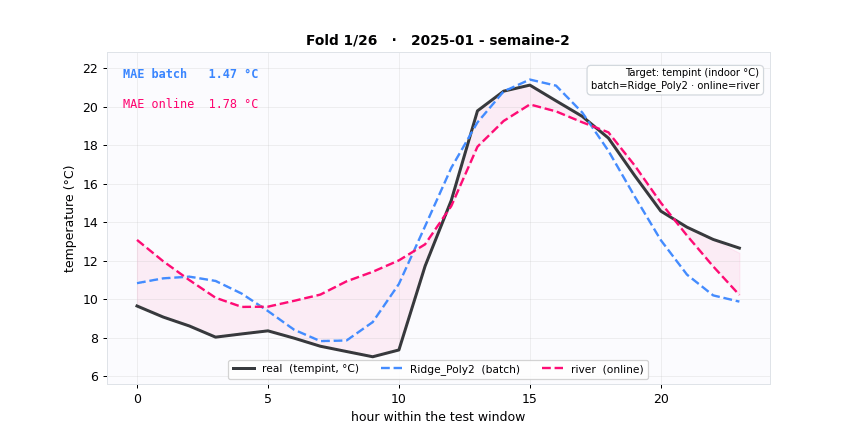
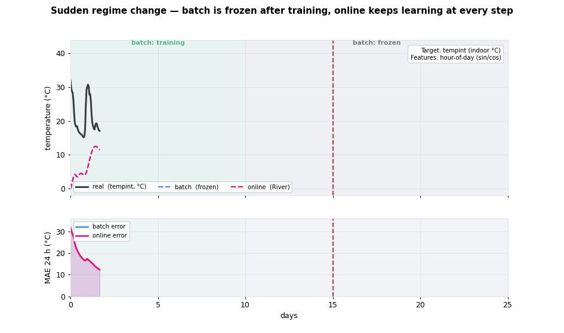
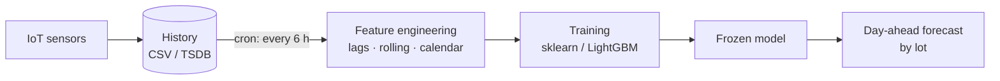
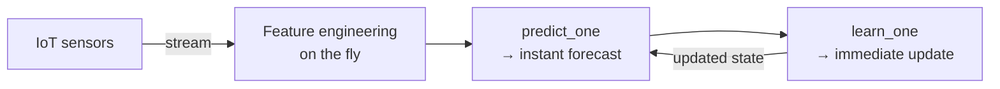

# 🌱 Greenhouse U5 — Temperature Forecasting: Batch vs Online Learning


Forecasting the **indoor temperature** (`tempint`) of a connected plastic greenhouse (IoT, unit **U5**)
from hourly sensor data. The goal: **optimize energy management** (heating, ventilation) by
anticipating thermal drift. The project **compares two inference paradigms** — **Batch** (lot-based
forecasting) and **Online** (learning on the fly) — on real data.

---

## 📑 Table of contents

- [Overview](#-overview)
- [Context & objective](#-context--objective)
- [Architecture: Batch vs Online](#️-architecture-batch-vs-online)
- [Project layout](#️-project-layout)
- [Tech stack](#-tech-stack)
- [Installation & configuration](#️-installation--configuration)
- [Usage](#-usage)
- [Data](#-data)
- [Methodology](#-methodology)
- [Comparison & Metrics](#-comparison--metrics)
- [Why online?](#-why-online-for-an-automated-greenhouse)
- [Roadmap](#️-roadmap--project-status)

---

## 👁️ Overview

**Batch vs Online, window by window** — each frame = one 24 h test window
(real in black, frozen batch `Ridge_Poly2` in blue, online `river` in red):



**Adaptation to a sudden change** — a regime shift injected mid-stream: the batch model
(frozen) stays off, the online model re-learns and returns to its pre-shock error level:



> Reproducible: `python results/make_comparison_gif.py` · `python results/make_drift_gif.py`

---

## 🎯 Context & objective

A connected greenhouse is a **non-stationary** environment: seasons, outdoor weather, structural
ageing, crops, sensor failures. A forecasting model deployed there becomes progressively obsolete.

**Main objective:** compare two inference strategies for forecasting `tempint`:

| Approach | Principle | Greenhouse use case |
|---|---|---|
| **Batch** | model trained once on history, then **frozen**; lot-based prediction (e.g. the day ahead, recomputed every 6 h) | day-ahead energy planning, maximal accuracy on a stable regime |
| **Online** | model updated **on each new** sensor observation (`predict → learn`) | real-time control, robustness to *concept drift* |

---

## 🏗️ Architecture: Batch vs Online

The fundamental difference is the **model update flow**.

**Batch mode** — the model is frozen between scheduled retrainings:



**Online mode** — the model learns continuously, sample by sample:



| Dimension | Batch | Online (River) |
|---|---|---|
| Update | periodic full retraining | incremental (1 sample) |
| Inference latency | per lot | per sample (~real time) |
| Memory | history required | O(1), no history |
| Drift adaptation | at next retraining | immediate |
| Accuracy (stable regime) | high | lower |

---

## 🗂️ Project layout

```
online ML test lina/
├── config/
│   └── config.yaml            # declarative spec: target, lags, CV, models
├── datas/                     # sensor + external weather data (CSV)
│   ├── serre_u5_climat.csv
│   ├── serre_u5_climat_all.csv
│   └── climat_exterieur_*_openmeteo.csv
├── notebooks/                 # exploration & experiments
│   ├── 01_eda.ipynb           # exploratory data analysis
│   ├── 02_features.ipynb      # feature engineering
│   ├── 03_cv.ipynb            # temporal cross-validation
│   ├── 04_models.ipynb        # training / comparison (run_all)
│   ├── 04_opti.ipynb          # hyperparameter tuning
│   └── 05_results.ipynb       # synthesis & visualizations
├── src/                       # reusable source code
│   ├── config.py              # loads config.yaml (cwd-independent)
│   ├── preprocess.py          # prepare_raw, GreenhousePipeline
│   ├── features.py            # calendar / lag / rolling features
│   ├── cv.py                  # bimonthly_splits, split_fold
│   ├── model_factory.py       # builds models from the YAML (importlib)
│   ├── river_model.py         # online model (River)
│   ├── evaluation.py          # evaluate_folds engine + 3 evaluators
│   ├── metrics.py             # compute_metrics (MAE/RMSE/R²/MAPE)
│   ├── journal.py             # log_run — experiment journal (JSON)
│   ├── results.py             # journal reading, global metrics, comparison table
│   ├── plots.py               # plotting functions
│   └── runner.py              # run_all — orchestration of all models
├── outputs/                   # run journal + per-fold detail
│   ├── xps_results.json
│   ├── fold_result_*.json
│   └── splits_info.csv
├── results/                   # visual deliverables
│   ├── figures/*.gif
│   ├── make_comparison_gif.py
│   └── make_drift_gif.py
├── requirements-notebook.txt
└── README.md
```

---

## 🧰 Tech stack

- **Python** ≥ 3.10
- **Pandas / NumPy** — time-series manipulation
- **scikit-learn** — batch models (Linear/Ridge/Lasso, RandomForest, pipelines)
- **LightGBM** — gradient boosting (batch)
- **River** — **online** learning (StandardScaler + incremental LinearRegression)
- **Matplotlib** — visualizations & GIF (PillowWriter)
- **PyYAML** — declarative configuration

---

## ⚙️ Installation & configuration

### 1. Environment

```bash
# Clone, then create an isolated environment
source .venv/bin/activate        # Windows: .venv\Scripts\activate

# Install dependencies
pip install -r requirements-notebook.txt
```

### 2. Pipeline configuration (`config/config.yaml`)

The **scientific** parameters (target, features, models) are declarative — no code to change
to add a model:

```yaml
target:    tempint
time_col:  timestamp
lags:             [24, 48]
rolling_windows:  [24, 48]
test_horizon:      24

models:
  Ridge_Poly2:
    type: sklearn
    steps:
      - {cls: PolynomialFeatures, params: {degree: 2, interaction_only: true}}
      - {cls: Ridge, params: {alpha: 1.0}}
  river:
    type: river
    params: {lr: 0.01, optimizer: adam}
  # Adding a model = one entry here (full path supported, e.g. sklearn.svm.SVR)
```

---

## 🚀 Usage

> For now, the full workflow runs through the **notebooks** — `notebooks/04_models.ipynb`
> (training & comparison via `run_all`) and `notebooks/05_results.ipynb` (synthesis &
> visualizations). A packaged CLI and an online inference API are on the
> [roadmap](#️-roadmap--project-status).

Run everything in Python via the orchestrator:

```python
from src.runner import run_all
import pandas as pd, yaml

cfg         = yaml.safe_load(open("config/config.yaml"))
df_raw      = pd.read_csv(cfg["path_data"])
splits_info = pd.read_csv(cfg["path_fold"])

results = run_all(cfg, splits_info, df_raw)   # train, evaluate, log, display metrics
```

Operational scripts (deliverable generation):

```bash
# Regenerate the comparison visualizations
python results/make_comparison_gif.py     # batch vs online per fold
python results/make_drift_gif.py          # adaptation to a sudden change
```

---

## 📊 Data

| File | Content |
|---|---|
| `datas/serre_u5_climat.csv` | Greenhouse U5 sensors |
| `datas/climat_exterieur_*_openmeteo.csv` | External weather (OpenMeteo) |

**Target:** `tempint` (indoor temperature, °C) <br>
**Time step:** hourly <br>
**Real range:** ~4 °C in winter → 60 °C+ in peak summer (closed plastic greenhouse)

---

## 🔬 Methodology

**Temporal cross-validation** (`src/cv.py`) — no leakage from the future:
- 2 test windows of **24 h** per month (week-2 and week-4);
- train = all history **prior** to the window.

**Feature engineering** (`src/features.py`, driven by `config.yaml`):
- **calendar**: hour, day, month (sine/cosine encoding), weekend;
- **lags**: `tempint` shifted by 24 h, 48 h…;
- **rolling**: moving mean / std (24 h, 48 h…);
- **trend**: differences between consecutive lags.

**Evaluated models**:
- *baseline*: `naive_24h` (ŷ(t) = temperature 24 h earlier);
- *batch*: LinearRegression, Ridge, Lasso, **Ridge_Poly2**, RandomForest, **LightGBM**;
- *online*: **River** (incremental LinearRegression, SGD / Adam / RMSProp).

---

## 📈 Comparison & Metrics

### Operational Batch vs Online comparison

| Criterion | Batch (`Ridge_Poly2`) | Online (`River`) |
|---|---|---|
| Global MAE (°C) | **≈ 1.9** | ≈ 3.4 |
| Drift adaptation | ❌ frozen between retrainings | ✅ continuous |
| Inference latency | per lot (D+1 / 6 h) | **< 1 ms / sample** * |
| Model update | full retraining | incremental (1 sample) |
| Compute cost | high, periodic (batch CPU) | **low, constant** * |
| Memory footprint | history required | O(1), no history * |

\* indicative values — *to be benchmarked* (see Roadmap).

### Leaderboard (**global** metrics, predictions concatenated across all folds)

| Model | Type | MAE (°C) | RMSE (°C) | R² | vs baseline |
|---|---|---:|---:|---:|---:|
| **Ridge_Poly2** | batch | **1.89** | 2.59 | **0.958** | −3 % |
| naive_24h | baseline | 1.95 | 2.82 | 0.697 | — |
| LightGBM | batch | 2.19 | 3.17 | 0.936 | +13 % |
| Lasso | batch | 2.90 | 3.98 | 0.899 | +49 % |
| LinearRegression | batch | 2.98 | 3.98 | 0.899 | +53 % |
| river | online | 3.44 | 4.78 | 0.854 | +77 % |

> ⚠️ **R² pitfall**: do not average the R² per fold (low variance over 24 h → unstable R²,
> sometimes negative). The table above recomputes each metric on **concatenated predictions**
> across all folds (`src/results.py > global_metrics`).

---

## 🧠 Why online for an automated greenhouse?

A frozen batch model becomes progressively obsolete as the environment evolves. The online model
(River) adapts continuously, without full retraining:

- **Concept drift** — the temperature/hour relationship changes between summer and winter; the online model follows these shifts automatically.
- **Embedded deployment** — updates on each sensor reading, with no retraining server (Raspberry Pi, PLC).
- **Low memory footprint** — no history storage.
- **Reactivity** — open window, heat spike, ventilation failure: recalibration within a few hours (cf. the *sudden change* GIF).

**The trade-off:** online is generally **less accurate** than batch on a stable regime, but **more
robust** over the long run in a living environment.

---

## 🗺️ Roadmap & project status

- [x] EDA, feature engineering, temporal CV
- [x] Batch models (sklearn / LightGBM) + baseline
- [x] Online model (River) + comparison
- [x] Experiment journal + global metrics (R²-pitfall-proof)
- [x] Visualizations (batch/online GIF, drift adaptation)
- [ ] **Latency & compute-cost benchmark** (fill the table with real measurements)
- [ ] **Exogenous** variables (external weather, solar radiation) — major accuracy lever
- [ ] **CLI** packaging (`src/cli.py`) and **online API** (real-time MQTT ingestion)
- [ ] "True real-time" deployment service (online forecast of the coming days)
- [ ] **Tune LightGBM** (num_leaves, max_depth, min_child_samples, early stopping)
- [ ] Predict a **target variant** (e.g. residual vs baseline `tempint(t) − tempint(t−24h)`, or Δtemperature) — easier to learn and guaranteed to beat the naive baseline

---

## 📄 License & author

Master's thesis project (TFM) — IoT greenhouse thermal forecasting.
Distributed under the **MIT** license.
